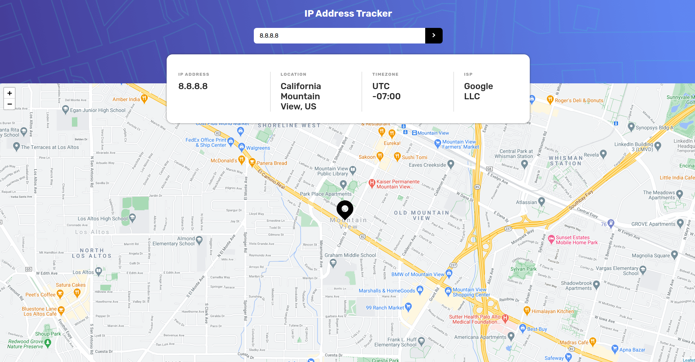

<h1 align="center"> IP Address Tracker </h1>

<p align="center">
  <a href="http://makeapullrequest.com">
    
  </a>
  <a href="https://opensource.org/licenses/MIT">
    
  </a>
</p>

<p>Small application just to learn new features of Vue3.</p>

<h2><a href="https://amazing-hopper-6f3d23.netlify.app/">Demo</a> </h2>




## Features

- ⚛ **Vue3**
- ♻ **Composition API**
- 💖 **leaflet**

## Getting started


1. Clone this repo using `git@github.com:julianosirtori/ip-address-tracker.git`
2. Move to the appropriate directory: `cd ip-address-tracker`.<br />
3. Run `yarn` to install dependencies.<br />
4. Copy and rename file .env.example `cp .env.example .env`<br />
4. Generate your key api in <a href="https://geo.ipify.org">ipify</a> and paste in VUE_APP_KEY_IPIFY <br />
4. Run `yarn serve` to see the example app at `http://localhost:8080`.


## Project setup
```
yarn install
```

### Compiles and hot-reloads for development
```
yarn serve
```

### Compiles and minifies for production
```
yarn build
```

### Lints and fixes files
```
yarn lint
```

### Customize configuration
See [Configuration Reference](https://cli.vuejs.org/config/).
